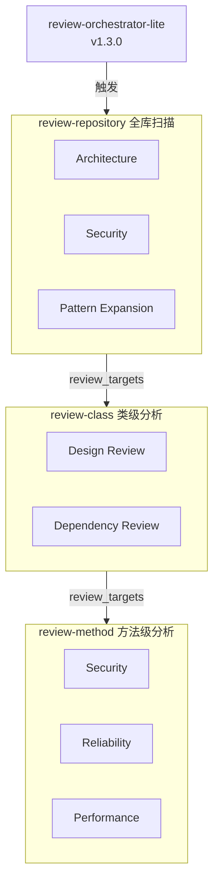

---

# Repository-Aware Cascading AI Review Agent

**Version**: v2.3.0
**Status**: Production Candidate
**Architecture**: Multi-Skill Cascading Review Framework
**Target**: Enterprise Java / Spring / MyBatis Repositories

---

## 1. 项目背景

传统 AI Code Review 工具普遍存在以下问题：

| 工具 | 优势 | 主要短板 |
|------|------|----------|
| SonarQube Community | 静态规则丰富 | 无 Repository Context |
| PR-Agent Community | PR 自动评论 | 仅关注 Diff |
| CodeRabbit | Review 体验好 | 缺少全库分析 |
| GPT 直接审查 | 灵活 | 无项目认知 |
| **本方案** | **Repository-Aware + Multi-Level Review** | **需建立索引** |

---

## 2. 设计目标

构建一个具备以下能力的 AI Review Framework：

- Repository Awareness
- Architecture Understanding
- Pattern Expansion
- Root Cause Analysis
- Automated Cascading Review

---

## 3. 核心设计思想

**传统工具**：

File Review

**本方案**：

Repository Review
   ↓
Class Review
   ↓
Method Review

实现逐层深入分析：

Where → Why → How

---

## 4. 整体架构

---

## 5. 四个 Skill 职责划分

### 5.1 review-repository

**目标**

发现：
- 系统性问题
- 架构问题
- 跨模块问题
- 安全问题
- 热点区域

回答：**哪里有问题？**

**分析维度**

| Angle A | Angle B | Angle C | Angle D | Angle E |
|---------|---------|---------|---------|---------|
| Architecture | Dependency | Security | Complexity | Global Defense |

**输出**

review_targets:
  - target: QuoteSectionServiceImpl
    skill: review-class
    score: 27

**Graph Budget**

| 参数 | 值 |
|------|-----|
| graph_depth_limit | 2 |
| max_graph_queries | 15 |

---

### 5.2 review-class

**目标**

分析单个类。

回答：**为什么会有问题？**

**分析维度**

- Responsibility
- Coupling
- Cohesion
- Dependency
- Pattern Usage
- Maintainability

**输出**

review_targets:
  - target: parsePI()
    skill: review-method
    score: 36

**Graph Budget**

| 参数 | 值 |
|------|-----|
| graph_depth_limit | 4 |
| max_graph_queries | 25 |

---

### 5.3 review-method

**目标**

分析具体方法。

回答：**具体怎么出问题？**

**分析维度**

- Security
- Reliability
- Performance
- Exception Handling
- Resource Management
- Business Logic

**Graph Budget**

| 参数 | 值 |
|------|-----|
| graph_depth_limit | 6 |
| max_graph_queries | 20 |

---

### 5.4 review-orchestrator-lite

**目标**

自动编排三个 Review Skill。

**职责**

- 调度
- 排序
- 队列管理
- Pattern 聚合
- 报告合并

**不负责**

- 发现问题
- 判断问题
- 修改代码

---

## 6. Review Cascade

执行流程：

Repository → Class → Method

**示例**：

发现 XXE
    ↓
定位类 QuoteSectionServiceImpl
    ↓
定位方法 parsePI()
    ↓
验证漏洞
    ↓
输出证据链

---

## 7. Navigation Artifact

Repository Review 输出：

review_targets:
  - target: parsePI
    skill: review-method
    severity: Critical
    confidence: CONFIRMED
    score: 36

**作用**：

- Agent 可消费
- Orchestrator 可调度
- 人类可阅读

---

## 8. Priority Score

确定性计算：

score = severity_weight × confidence_weight × impact_scope

**Severity**

| 级别 | 权重 |
|------|------|
| Critical | 4 |
| Major | 3 |
| Minor | 2 |
| Info | 1 |

**Confidence**

| 级别 | 权重 |
|------|------|
| CONFIRMED | 1.0 |
| PLAUSIBLE | 0.6 |

**Impact Scope**

| 范围 | 权重 |
|------|------|
| CrossModule | 3 |
| MultiFile | 2 |
| SingleFile | 1 |

---

## 9. Phase 2.5 Pattern Expansion

v2.3 核心能力。

**目的**：证明问题是系统性的，而不是偶发的。

---

## 10. Hybrid Retrieval

### Symbolic Pattern

**示例**：
- DocumentBuilderFactory
- ObjectInputStream
- Runtime.exec()

**使用**：search、callers、callees、impact

### Structural Pattern

**示例**：
- catch(Exception)
- Thread.sleep()
- System.out.println()

**使用**：grep

### Convention Pattern

**示例**：
- ${whereSql}
- ${customSqlSegment}

**使用**：search + grep

---

## 11. Systemic Detection

判定系统性问题：

affected_modules >= 3

OR

affected_files >= 10

OR

total_hits >= 50 AND true_positive_rate >= 0.8

---

## 12. Confidence Calibration

避免错误判断：grep 命中很多 ≠ 系统性问题。

**流程**：

grep
   ↓
统计 total_hits
   ↓
抽样验证
   ↓
计算 true_positive_rate
   ↓
判断 systemic

---

## 13. CodeGraph Integration

**当前使用能力**

| API | 状态 |
|-----|------|
| codegraph_explore | 已使用 |
| codegraph_search | 已使用 |
| codegraph_callers | 已使用 |
| codegraph_callees | 已使用 |
| codegraph_impact | 已使用 |
| codegraph_node | 已使用 |
| codegraph_files | 已使用 |
| codegraph_status | 已使用 |

**利用率**

| 版本 | 利用率 |
|------|--------|
| v2.1 | 1 / 8 |
| v2.3 | 8 / 8 |

---

## 14. 相比 SonarQube 的补强

**SonarQube**：Rule-Based

**本方案**：Rule + Repository Context + Architecture Context + Pattern Expansion

**补足**：
- 跨模块分析
- 根因聚类
- 系统性问题识别
- 调用链理解

---

## 15. 相比 PR-Agent 的补强

**PR-Agent**：Diff Review

**本方案**：Repository Review

**补足**：
- 历史代码
- 跨文件依赖
- 架构设计
- 热点区域
- Pattern Family

---

## 16. 当前版本能力矩阵

| 能力 | SonarQube CE | PR-Agent CE | 本方案 |
|------|:---:|:---:|:---:|
| 单文件分析 | ✅ | ✅ | ✅ |
| PR 分析 | ❌ | ✅ | ✅ |
| Repository Awareness | ❌ | ❌ | ✅ |
| Architecture Review | ❌ | ❌ | ✅ |
| Pattern Expansion | ❌ | ❌ | ✅ |
| Root Cause Analysis | ❌ | ❌ | ✅ |
| Multi-Level Review | ❌ | ❌ | ✅ |
| Cascading Review | ❌ | ❌ | ✅ |
| Pattern Family Aggregation | ❌ | ❌ | ✅ |
| Hybrid Retrieval | ❌ | ❌ | ✅ |

---

## 17. 当前版本状态

| Skill | Version |
|-------|---------|
| review-repository | v2.3.0 |
| review-class | v2.3.0 |
| review-method | v2.3.0 |
| review-orchestrator | v1.3.0 |

---

## 18. 下一阶段路线图

### Phase 4A（已完成）

- Orchestrator Lite

### Phase 4B

- Pattern Family Dashboard
- Cross Repository Learning
- Historical Review Memory

### Phase 5

- Knowledge Graph
- Repository Knowledge Base
- Architecture Memory

---

## 总结

本项目通过：

Repository Review
  ↓
Class Review
  ↓
Method Review
  ↓
Pattern Expansion
  ↓
Hybrid Retrieval
  ↓
Pattern Family Aggregation

构建了一套超越传统 SAST 和 PR Review 工具的 **Repository-Aware Cascading AI Review Framework**，重点解决：

发现问题 → 定位问题 → 解释问题 → 证明问题是系统性的

形成企业级代码审查闭环。

---
